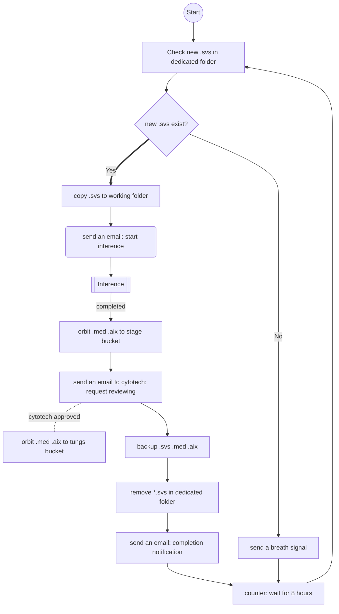

## Auto Inference Workflow
### Service model -- Tungs case

```mermaid
graph TB
  id1((Start)) --> id2[Check new .svs in dedicated folder]
  id2 --> id3{new .svs exist?}
  id3 == Yes ==> id4[copy .svs to working folder]
  id3 -->|No| id5[send a breath signal]
  id4 --> id6(send an email: start inference)
  id6 --> id7[[Inference]]
  id7 -->|completed| id8[orbit .med .aix to stage bucket]
  id8 --> id9[send an email to cytotech: request reviewing]
  id9 -. cytotech approved .- id10[orbit .med .aix to tungs bucket]
  id9 --> id11[backup .svs .med .aix]
  id11 --> id12[remove *.svs in dedicated folder]
  id12 --> id13[send an email: completion notification]
  id13 --> id14[counter: wait for 8 hours]
  id14 --> id2
  id5 --> id14
```

### Copyrights &copy; 2003, AIxMed INC.
