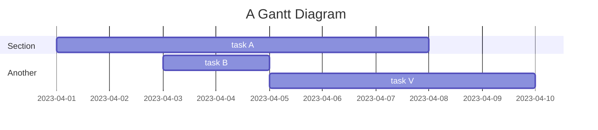
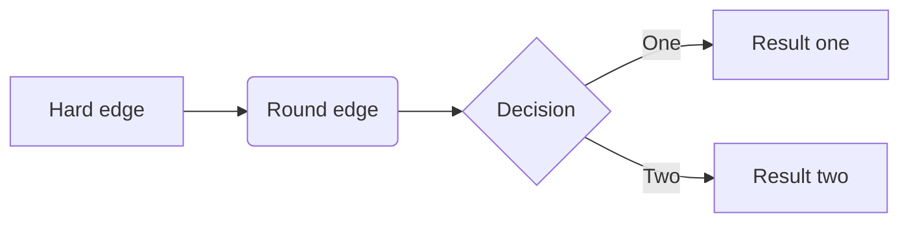
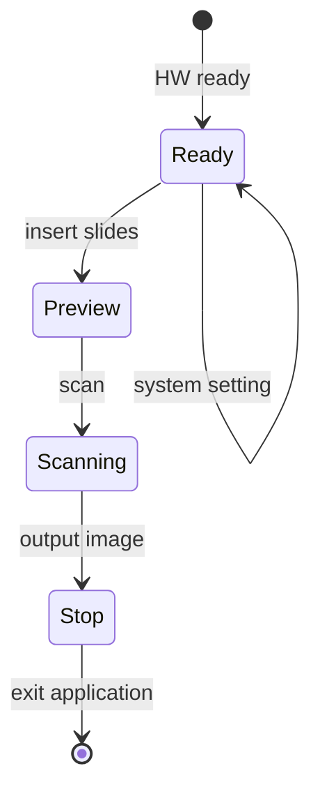

# documents for IPG

```mermaid
gantt
  title A Gantt Diagram
  todayMarker on
  dateFormat YYYY-MM-DD
  
  section Section
  task A  :a1, 2023-04-01, 1w
  
  section Another
  task B  : 2023-04-03, 2d
  task V  : 5d
```

```mermaid
graph TD;
    A-->B;
    A-->C;
    B-->D;
    C-->D;
```

```mermaid
graph LR
A[Hard edge] -->B(Round edge)
    B --> C{Decision}
    C -->|One| D[Result one]
    C -->|Two| E[Result two]
```

```mermaid
stateDiagram
  state "Ready" as INIT
  state "Preview" as PREV
  state "Scanning" as SCAN
  state "Stop" as STOP
  
  [*] --> INIT: HW ready
  INIT --> INIT: system setting
  INIT --> PREV: insert slides
  PREV --> SCAN: scan
  SCAN --> STOP: output image
  STOP --> [*]: exit application
```

